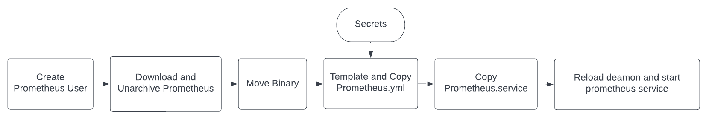
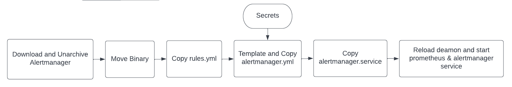

# Ansible Configure Prometheus

[![License][license-image]][license-url]

Ansible playbook to download and configure prometheus with alert manager and slack notifications.

## Roles

### Configure Prometheus

### Configure AlertManager

## License

This project is licensed under the MIT License - see the [LICENSE](LICENSE) file for details

[license-image]: https://img.shields.io/badge/License-MIT-brightgreen.svg
[license-url]: https://opensource.org/licenses/MIT
